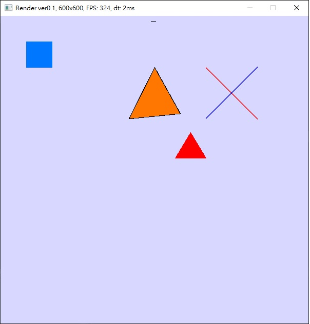

# myMinirender-w32Interface
simple w32 temp

## Run

`Open myMiniRender.vcxproj with VisualStudio`

## Example

## Reference
https://github.com/ssloy/tinyrenderer

https://github.com/skywind3000/mini3d
